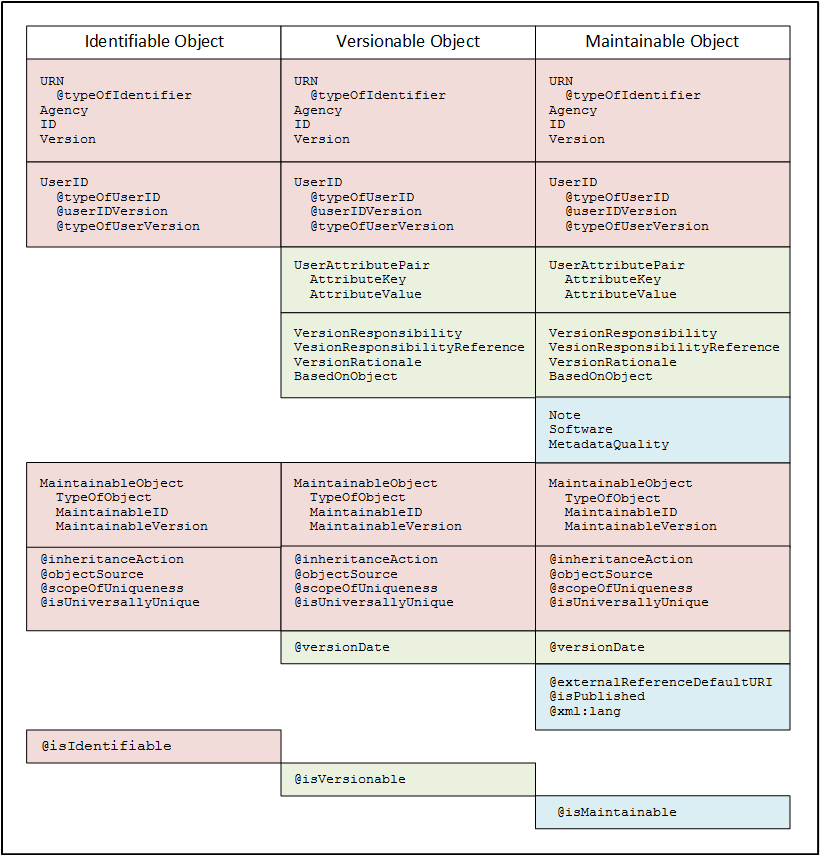
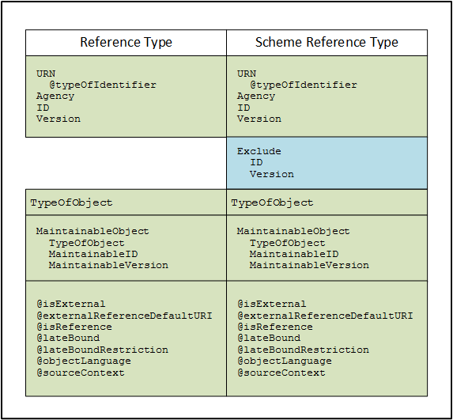

Identifiable, Versionable, Maintainable
========================================

**Figure 2.  The relationship between identifiable, versionable and maintainable type objects**

|figure2|

N.B.Those names starting with @ are XML attributes, all others are XML
elements.

The following objects which consist of the extension bases used for
identification and referencing purposes are considered to be
Administrative metadata for the purposes of versioning:

Identifiable
-------------

+------------------------+------------------------------------------------------------------------------------------------------------------------------------------------------------------------------------+
| Identifiable Object    | Extension base is AbstractIdentifiable                                                                                                                                             |
+========================+====================================================================================================================================================================================+
| URN                    | See URN Structure below                                                                                                                                                            |
+------------------------+------------------------------------------------------------------------------------------------------------------------------------------------------------------------------------+
| @typeOfIdentifier      | URN used by Agency [Canonical \| Deprecated]                                                                                                                                       |
+------------------------+------------------------------------------------------------------------------------------------------------------------------------------------------------------------------------+
| Agency                 | Base sequence of identification. If sequence is used, all are required.                                                                                                            |
+------------------------+------------------------------------------------------------------------------------------------------------------------------------------------------------------------------------+
| ID                     |                                                                                                                                                                                    |
+------------------------+------------------------------------------------------------------------------------------------------------------------------------------------------------------------------------+
| Version                |                                                                                                                                                                                    |
+------------------------+------------------------------------------------------------------------------------------------------------------------------------------------------------------------------------+
| UserID                 |                                                                                                                                                                                    |
+------------------------+------------------------------------------------------------------------------------------------------------------------------------------------------------------------------------+
| @typeOfUserID          | A user specified identification for a specific system such as a DOI or internal search engine. Both the ID and @typeOfUserID must be specified. Version information is optional.   |
+------------------------+------------------------------------------------------------------------------------------------------------------------------------------------------------------------------------+
| @userIDVersion         |                                                                                                                                                                                    |
+------------------------+------------------------------------------------------------------------------------------------------------------------------------------------------------------------------------+
| @typeOfUserVersion     |                                                                                                                                                                                    |
+------------------------+------------------------------------------------------------------------------------------------------------------------------------------------------------------------------------+
| MaintainableObject     |                                                                                                                                                                                    |
+------------------------+------------------------------------------------------------------------------------------------------------------------------------------------------------------------------------+
| TypeOfObject           | The Maintainable object containing the Identifiable object. TypeOfObject is required to create Deprecated URN. ID is required for any URN if                                       |
|                        |                                                                                                                                                                                    |
|                        | ScopeOfUniqueness = ”Maintainable”.                                                                                                                                                |
|                        |                                                                                                                                                                                    |
|                        | Version number provides context base.                                                                                                                                              |
+------------------------+------------------------------------------------------------------------------------------------------------------------------------------------------------------------------------+
| MaintainableID         |                                                                                                                                                                                    |
+------------------------+------------------------------------------------------------------------------------------------------------------------------------------------------------------------------------+
| MaintainableVersion    |                                                                                                                                                                                    |
+------------------------+------------------------------------------------------------------------------------------------------------------------------------------------------------------------------------+
| @inheritanceAction     | See Grouping: Inheritance                                                                                                                                                          |
+------------------------+------------------------------------------------------------------------------------------------------------------------------------------------------------------------------------+
| @objectSource          | The object source of a resolved reference                                                                                                                                          |
+------------------------+------------------------------------------------------------------------------------------------------------------------------------------------------------------------------------+
| @scopeOfUniqueness     | Scope used by Agency [Agency \| Maintainable                                                                                                                                       |
+------------------------+------------------------------------------------------------------------------------------------------------------------------------------------------------------------------------+
| @IsUniversallyUnique   | States the scope of uniqueness for the ID                                                                                                                                          |
+------------------------+------------------------------------------------------------------------------------------------------------------------------------------------------------------------------------+
| @isIdentifiable        | Fixed value = “true” [specifies object base]                                                                                                                                       |
+------------------------+------------------------------------------------------------------------------------------------------------------------------------------------------------------------------------+

Versionable
-------------

+---------------------------------+------------------------------------------------------------------------------------------------------------------------------------------------------------------------------------+
| Versionable Object              | Extension base is AbstractIdentifiable                                                                                                                                             |
+=================================+====================================================================================================================================================================================+
| URN                             | See URN Structure below                                                                                                                                                            |
+---------------------------------+------------------------------------------------------------------------------------------------------------------------------------------------------------------------------------+
| @typeOfIdentifier               | URN used by Agency [Canonical \| Deprecated]                                                                                                                                       |
+---------------------------------+------------------------------------------------------------------------------------------------------------------------------------------------------------------------------------+
| Agency                          | Base sequence of identification. If sequence is used, all are required.                                                                                                            |
+---------------------------------+------------------------------------------------------------------------------------------------------------------------------------------------------------------------------------+
| ID                              |                                                                                                                                                                                    |
+---------------------------------+------------------------------------------------------------------------------------------------------------------------------------------------------------------------------------+
| Version                         |                                                                                                                                                                                    |
+---------------------------------+------------------------------------------------------------------------------------------------------------------------------------------------------------------------------------+
| UserID                          |                                                                                                                                                                                    |
+---------------------------------+------------------------------------------------------------------------------------------------------------------------------------------------------------------------------------+
| @typeOfUserID                   | A user specified identification for a specific system such as a DOI or internal search engine. Both the ID and @typeOfUserID must be specified. Version information is optional.   |
+---------------------------------+------------------------------------------------------------------------------------------------------------------------------------------------------------------------------------+
| @userIDVersion                  |                                                                                                                                                                                    |
+---------------------------------+------------------------------------------------------------------------------------------------------------------------------------------------------------------------------------+
| @typeOfUserVersion              |                                                                                                                                                                                    |
+---------------------------------+------------------------------------------------------------------------------------------------------------------------------------------------------------------------------------+
| UserAttributePair               |                                                                                                                                                                                    |
+---------------------------------+------------------------------------------------------------------------------------------------------------------------------------------------------------------------------------+
| AttributeKey                    | User defined Key/Value pair used to support interaction of the metadata within the user’s system.                                                                                  |
+---------------------------------+------------------------------------------------------------------------------------------------------------------------------------------------------------------------------------+
| AttributeValue                  |                                                                                                                                                                                    |
+---------------------------------+------------------------------------------------------------------------------------------------------------------------------------------------------------------------------------+
| VersionResponsibility           | Who within the Agency versioned the object                                                                                                                                         |
+---------------------------------+------------------------------------------------------------------------------------------------------------------------------------------------------------------------------------+
| VesionResponsibilityReference   | Alternate reference to who versioned the object                                                                                                                                    |
+---------------------------------+------------------------------------------------------------------------------------------------------------------------------------------------------------------------------------+
| VersionRationale                | Reason for version change (to inform user)                                                                                                                                         |
+---------------------------------+------------------------------------------------------------------------------------------------------------------------------------------------------------------------------------+
| BasedOnReference                |                                                                                                                                                                                    |
+---------------------------------+------------------------------------------------------------------------------------------------------------------------------------------------------------------------------------+
| MaintainableObject              |                                                                                                                                                                                    |
+---------------------------------+------------------------------------------------------------------------------------------------------------------------------------------------------------------------------------+
| TypeOfObject                    | The Maintainable object containing the Identifiable object. TypeOfObject is required to create Deprecated URN. ID is required for any URN if                                       |
|                                 |                                                                                                                                                                                    |
|                                 | ScopeOfUniqueness = ”Maintainable”.                                                                                                                                                |
|                                 |                                                                                                                                                                                    |
|                                 | Version number provides context base.                                                                                                                                              |
+---------------------------------+------------------------------------------------------------------------------------------------------------------------------------------------------------------------------------+
| MaintainableID                  |                                                                                                                                                                                    |
+---------------------------------+------------------------------------------------------------------------------------------------------------------------------------------------------------------------------------+
| MaintainableVersion             |                                                                                                                                                                                    |
+---------------------------------+------------------------------------------------------------------------------------------------------------------------------------------------------------------------------------+
| @inheritanceAction              | See Grouping: Inheritance                                                                                                                                                          |
+---------------------------------+------------------------------------------------------------------------------------------------------------------------------------------------------------------------------------+
| @objectSource                   | The object source of a resolved reference                                                                                                                                          |
+---------------------------------+------------------------------------------------------------------------------------------------------------------------------------------------------------------------------------+
| @scopeOfUniqueness              | Scope used by Agency [Agency \| Maintainable                                                                                                                                       |
+---------------------------------+------------------------------------------------------------------------------------------------------------------------------------------------------------------------------------+
| @IsUniversallyUnique            | States the scope of uniqueness for the ID                                                                                                                                          |
+---------------------------------+------------------------------------------------------------------------------------------------------------------------------------------------------------------------------------+
| @isVersionable                  | Fixed value = “true” [specifies object base]                                                                                                                                       |
+---------------------------------+------------------------------------------------------------------------------------------------------------------------------------------------------------------------------------+
| @versionDate                    | Date/Time of version change                                                                                                                                                        |
+---------------------------------+------------------------------------------------------------------------------------------------------------------------------------------------------------------------------------+

Maintainable
-------------

+---------------------------------+-----------------------------------------------------------------------------------------------------+
| Maintainable Object             | Extension base is AbstractMaintainable                                                              |
+=================================+=====================================================================================================+
| URN                             | See URN Structure below                                                                             |
+---------------------------------+-----------------------------------------------------------------------------------------------------+
| @typeOfIdentifier               | URN used by Agency [Canonical \| Deprecated]                                                        |
+---------------------------------+-----------------------------------------------------------------------------------------------------+
| Agency                          | Base sequence of identification. If sequence is used, all are required                              |
+---------------------------------+-----------------------------------------------------------------------------------------------------+
| ID                              |                                                                                                     |
+---------------------------------+-----------------------------------------------------------------------------------------------------+
| Version                         |                                                                                                     |
+---------------------------------+-----------------------------------------------------------------------------------------------------+
| UserID                          |                                                                                                     |
+---------------------------------+-----------------------------------------------------------------------------------------------------+
| @typeOfUserID                   | A user specified identification for a specific system such as a DOI or internal search engine.      |
|                                 |                                                                                                     |
|                                 | Version information is optional.                                                                    |
|                                 |                                                                                                     |
|                                 | Both the ID and @typeOfUserID must be specified.                                                    |
+---------------------------------+-----------------------------------------------------------------------------------------------------+
| @userIDVersion                  |                                                                                                     |
+---------------------------------+-----------------------------------------------------------------------------------------------------+
| @typeOfUserVersion              |                                                                                                     |
+---------------------------------+-----------------------------------------------------------------------------------------------------+
| UserAttributePair               |                                                                                                     |
+---------------------------------+-----------------------------------------------------------------------------------------------------+
| AttributeKey                    | User defined Key/Value pair used to support interaction of the metadata within the user’s system.   |
+---------------------------------+-----------------------------------------------------------------------------------------------------+
| AttributeValue                  |                                                                                                     |
+---------------------------------+-----------------------------------------------------------------------------------------------------+
| VersionResponsibility           | Who within the Agency versioned the object                                                          |
+---------------------------------+-----------------------------------------------------------------------------------------------------+
| VesionResponsibilityReference   | Alternate reference to who versioned the object                                                     |
+---------------------------------+-----------------------------------------------------------------------------------------------------+
| VersionRationale                | Reason for version change (to inform user)                                                          |
+---------------------------------+-----------------------------------------------------------------------------------------------------+
| BasedOnReference                |                                                                                                     |
+---------------------------------+-----------------------------------------------------------------------------------------------------+
| Note                            | Notes related to objects with the maintainable (Payload)                                            |
+---------------------------------+-----------------------------------------------------------------------------------------------------+
| Software                        | Software used to create the Maintainable object (Payload)                                           |
+---------------------------------+-----------------------------------------------------------------------------------------------------+
| MetadataQuality                 | Quality of the metadata in the Maintainable object (Payload)                                        |
+---------------------------------+-----------------------------------------------------------------------------------------------------+
| MaintainableObject              | Same as Identifiable Object                                                                         |
+---------------------------------+-----------------------------------------------------------------------------------------------------+
| @inheritanceAction              | See Grouping: Inheritance                                                                           |
+---------------------------------+-----------------------------------------------------------------------------------------------------+
| @objectSource                   | The object source of a resolved reference                                                           |
+---------------------------------+-----------------------------------------------------------------------------------------------------+
| @scopeOfUniqueness              | Scope used by Agency [Agency \| Maintainable                                                        |
+---------------------------------+-----------------------------------------------------------------------------------------------------+
| @IsUniversallyUnique            | States the scope of uniqueness for the ID                                                           |
+---------------------------------+-----------------------------------------------------------------------------------------------------+
| @isMaintainable                 | Fixed value = “true” [specifies object base]                                                        |
+---------------------------------+-----------------------------------------------------------------------------------------------------+
| @versionDate                    | Date/Time of version change                                                                         |
+---------------------------------+-----------------------------------------------------------------------------------------------------+
| @externalReferenceDefaultURI    | Indicates that the content is available for reuse by reference                                      |
+---------------------------------+-----------------------------------------------------------------------------------------------------+
| @isPublished                    | Indicates that the contents are persistent and can be referenced by external documents              |
+---------------------------------+-----------------------------------------------------------------------------------------------------+
| @xml:lang                       | The language of the metadata in the Maintainable object (Payload)                                   |
+---------------------------------+-----------------------------------------------------------------------------------------------------+

**Figure 3.  The relationship between ReferenceType and SchemeReferenceType**

|figure3|

Reference Type
---------------

+--------------------------------+--------------------------------------------------------------------------------------------------------------------------------------------------------------------------------------------------------------------------------------+
| Reference Type                 |                                                                                                                                                                                                                                      |
+================================+======================================================================================================================================================================================================================================+
| URN                            | The URN of the object being referenced using the specified URN structure                                                                                                                                                             |
+--------------------------------+--------------------------------------------------------------------------------------------------------------------------------------------------------------------------------------------------------------------------------------+
| @typeOfIdentifier              | URN used by Agency [Canonical \| Deprecated]                                                                                                                                                                                         |
+--------------------------------+--------------------------------------------------------------------------------------------------------------------------------------------------------------------------------------------------------------------------------------+
| Agency                         | Base sequence of identification. If sequence is used, all are required.                                                                                                                                                              |
+--------------------------------+--------------------------------------------------------------------------------------------------------------------------------------------------------------------------------------------------------------------------------------+
| ID                             | The ID of the object being referenced.                                                                                                                                                                                               |
+--------------------------------+--------------------------------------------------------------------------------------------------------------------------------------------------------------------------------------------------------------------------------------+
| Version                        | The Version of the object being referenced. This is the full Version number at the time the reference is created.                                                                                                                    |
+--------------------------------+--------------------------------------------------------------------------------------------------------------------------------------------------------------------------------------------------------------------------------------+
| TypeOfObject                   | Type of object being referenced. This is a controlled list.                                                                                                                                                                          |
+--------------------------------+--------------------------------------------------------------------------------------------------------------------------------------------------------------------------------------------------------------------------------------+
| MaintainableObject             | The Maintainable object containing of the Identifiable or Versionable object being referenced.                                                                                                                                       |
+--------------------------------+--------------------------------------------------------------------------------------------------------------------------------------------------------------------------------------------------------------------------------------+
| TypeOfObject                   | TypeOfObject is required to create Deprecated URN                                                                                                                                                                                    |
+--------------------------------+--------------------------------------------------------------------------------------------------------------------------------------------------------------------------------------------------------------------------------------+
| MaintainableID                 | Required for any URN if                                                                                                                                                                                                              |
|                                |                                                                                                                                                                                                                                      |
|                                | ScopeOfUniqueness=”Maintainable”.                                                                                                                                                                                                    |
+--------------------------------+--------------------------------------------------------------------------------------------------------------------------------------------------------------------------------------------------------------------------------------+
| MaintainableVersion            | Provides context base                                                                                                                                                                                                                |
+--------------------------------+--------------------------------------------------------------------------------------------------------------------------------------------------------------------------------------------------------------------------------------+
| @isExternal                    | Boolean attribute. If “true” you must supply the URN                                                                                                                                                                                 |
+--------------------------------+--------------------------------------------------------------------------------------------------------------------------------------------------------------------------------------------------------------------------------------+
| @externalReferenceDefaultURI   | A local store for the referenced object expressed as a URI                                                                                                                                                                           |
+--------------------------------+--------------------------------------------------------------------------------------------------------------------------------------------------------------------------------------------------------------------------------------+
| @isReference                   | Fixed value = “true” [specifies object base]                                                                                                                                                                                         |
+--------------------------------+--------------------------------------------------------------------------------------------------------------------------------------------------------------------------------------------------------------------------------------+
| @lateBound                     | Boolean attribute. Set to “true” if you wish to late-bind the reference (i.e., want to reference the most recent version)                                                                                                            |
+--------------------------------+--------------------------------------------------------------------------------------------------------------------------------------------------------------------------------------------------------------------------------------+
| @lateBoundRestriction          | If @lateBound=”true” and this attribute is not provided you will get the most recent version. Use this attribute to restrict the value of the late-bind, for example to restrict to the most recent minor version of major version   |
+--------------------------------+--------------------------------------------------------------------------------------------------------------------------------------------------------------------------------------------------------------------------------------+
| @objectLanguage                | Specify the desired language content (if available) for the referenced item using a valid xml:lang value.                                                                                                                            |
+--------------------------------+--------------------------------------------------------------------------------------------------------------------------------------------------------------------------------------------------------------------------------------+
| @sourceContext                 | The URN of the parent maintainable at the time of reference (this is not necessarily the same version number as the version of the parent maintainable at point of origin)                                                           |
+--------------------------------+--------------------------------------------------------------------------------------------------------------------------------------------------------------------------------------------------------------------------------------+

Scheme Reference Type
-----------------------

+--------------------------------+--------------------------------------------------------------------------------------------------------------------------------------------------------------------------------------------------------------------------------------+
| Scheme Reference Type          |                                                                                                                                                                                                                                      |
+================================+======================================================================================================================================================================================================================================+
| URN                            | The URN of the object being referenced using the specified URN structure                                                                                                                                                             |
+--------------------------------+--------------------------------------------------------------------------------------------------------------------------------------------------------------------------------------------------------------------------------------+
| @typeOfIdentifier              | URN used by Agency [Canonical \| Deprecated]                                                                                                                                                                                         |
+--------------------------------+--------------------------------------------------------------------------------------------------------------------------------------------------------------------------------------------------------------------------------------+
| Agency                         | Base sequence of identification. If sequence is used, all are required.                                                                                                                                                              |
+--------------------------------+--------------------------------------------------------------------------------------------------------------------------------------------------------------------------------------------------------------------------------------+
| ID                             | The ID of the object being referenced.                                                                                                                                                                                               |
+--------------------------------+--------------------------------------------------------------------------------------------------------------------------------------------------------------------------------------------------------------------------------------+
| Version                        | The Version of the object being referenced. This is the full Version number at the time the reference is created.                                                                                                                    |
+--------------------------------+--------------------------------------------------------------------------------------------------------------------------------------------------------------------------------------------------------------------------------------+
| TypeOfObject                   | Type of object being referenced. This is a controlled list.                                                                                                                                                                          |
+--------------------------------+--------------------------------------------------------------------------------------------------------------------------------------------------------------------------------------------------------------------------------------+
| MaintainableObject             | The Maintainable object containing of the Identifiable or Versionable object being referenced.                                                                                                                                       |
+--------------------------------+--------------------------------------------------------------------------------------------------------------------------------------------------------------------------------------------------------------------------------------+
| TypeOfObject                   | TypeOfObject is required to create a Deprecated URN                                                                                                                                                                                  |
+--------------------------------+--------------------------------------------------------------------------------------------------------------------------------------------------------------------------------------------------------------------------------------+
| MaintainableID                 | Required for any URN if                                                                                                                                                                                                              |
|                                |                                                                                                                                                                                                                                      |
|                                | ScopeOfUniqueness=”Maintainable”.                                                                                                                                                                                                    |
+--------------------------------+--------------------------------------------------------------------------------------------------------------------------------------------------------------------------------------------------------------------------------------+
| MaintainableVersion            | Provides context base                                                                                                                                                                                                                |
+--------------------------------+--------------------------------------------------------------------------------------------------------------------------------------------------------------------------------------------------------------------------------------+
| Exclude                        | Allows the identification of objects within the                                                                                                                                                                                      |
|                                |                                                                                                                                                                                                                                      |
|                                | Scheme which are to be excluded for the                                                                                                                                                                                              |
|                                |                                                                                                                                                                                                                                      |
|                                | purpose of this reference.                                                                                                                                                                                                           |
+--------------------------------+--------------------------------------------------------------------------------------------------------------------------------------------------------------------------------------------------------------------------------------+
| ID                             | The ID of the excluded object.                                                                                                                                                                                                       |
+--------------------------------+--------------------------------------------------------------------------------------------------------------------------------------------------------------------------------------------------------------------------------------+
| Version                        | The Version of the excluded object.                                                                                                                                                                                                  |
+--------------------------------+--------------------------------------------------------------------------------------------------------------------------------------------------------------------------------------------------------------------------------------+
| @isExternal                    | Boolean attribute. If “true” you must supply the URN                                                                                                                                                                                 |
+--------------------------------+--------------------------------------------------------------------------------------------------------------------------------------------------------------------------------------------------------------------------------------+
| @externalReferenceDefaultURI   | A local store for the referenced object expressed as a URI                                                                                                                                                                           |
+--------------------------------+--------------------------------------------------------------------------------------------------------------------------------------------------------------------------------------------------------------------------------------+
| @isReference                   | Fixed value = “true” [specifies object base]                                                                                                                                                                                         |
+--------------------------------+--------------------------------------------------------------------------------------------------------------------------------------------------------------------------------------------------------------------------------------+
| @lateBound                     | Boolean attribute. Set to “true” if you wish to late-bind the reference (i.e., want to reference the most recent version)                                                                                                            |
+--------------------------------+--------------------------------------------------------------------------------------------------------------------------------------------------------------------------------------------------------------------------------------+
| @lateBoundRestriction          | If @lateBound=”true” and this attribute is not provided you will get the most recent version. Use this attribute to restrict the value of the late-bind, for example to restrict to the most recent minor version of major version   |
+--------------------------------+--------------------------------------------------------------------------------------------------------------------------------------------------------------------------------------------------------------------------------------+
| @objectLanguage                | Specify the desired language content (if available) for the referenced item using a valid xml:lang value.                                                                                                                            |
+--------------------------------+--------------------------------------------------------------------------------------------------------------------------------------------------------------------------------------------------------------------------------------+
| @sourceContext                 | The URN of the parent maintainable at the time of reference (this is not necessarily the same version number as the version of the parent maintainable at point of origin)                                                           |
+--------------------------------+--------------------------------------------------------------------------------------------------------------------------------------------------------------------------------------------------------------------------------------+
