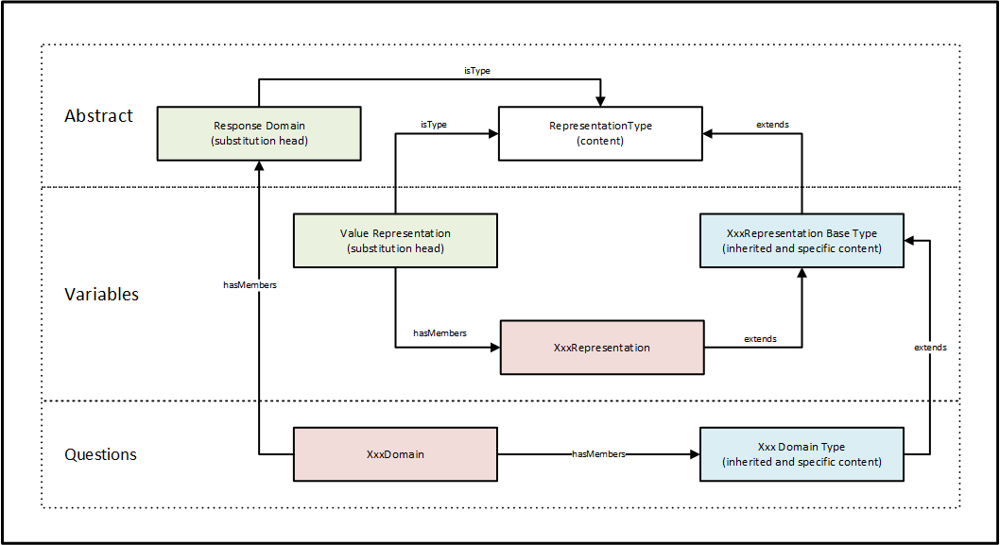
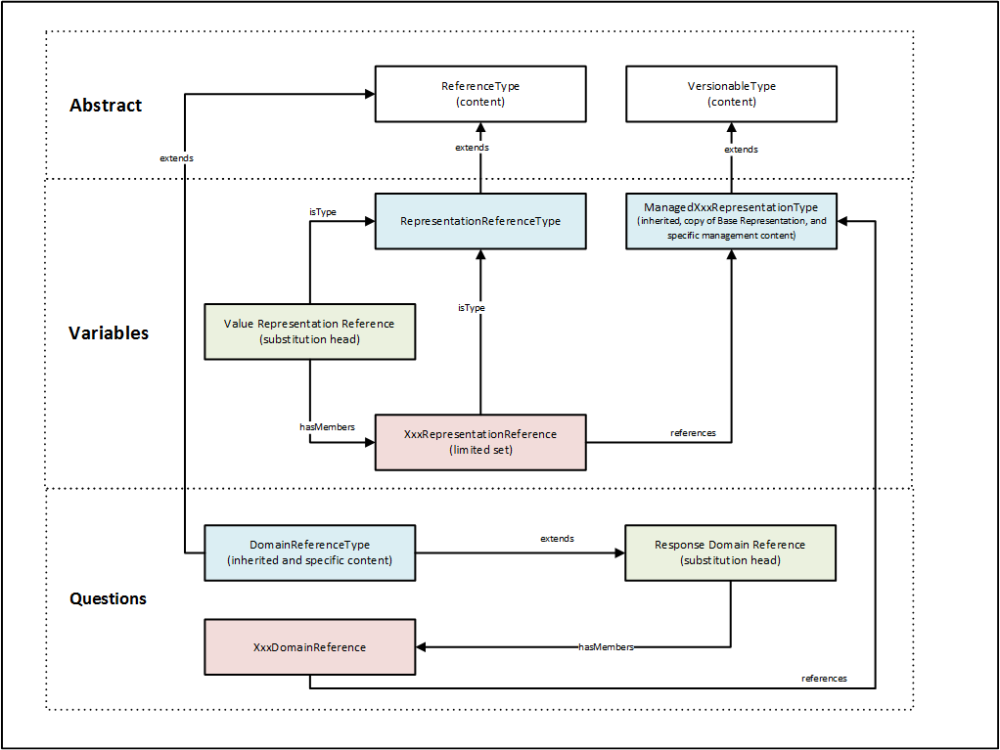

Representations
---------------

Representations describe the structure and content of data as it is
captured from the population and held within a data file. They share
common category schemes and code list as well as the means of defining
numeric ranges and text content. DDI begins by defining the core
descriptive content for a wide range of representations and *then adds a
set of common objects* used by all Value Representations (Variables) or
Response Domains (Questions) in their applied use.

A number of these representations also have a Managed version which
allows a single description of a Representation to be reused within and
between studies. Some Representations reference reusable structures
(Category Schemes, Code Lists, etc.) and are already reusable. Others
such as Numeric Representations have a Managed Representation contained
in a ManagedRepresentationScheme located in Logical Product. This Scheme
contains all forms of Managed Representations and supports the standard
Scheme organizational objects that allow for grouping and classification
according to Subjects, Keywords, Concept, and Universe

Whether you provide representations inline or manage them within a
scheme, they contain the same information. High level descriptions are
shown below, detailed explanations are described in the Specific
Structures section.

Variables use the representation substitutions found in reusable
directly as substitution types for VariableRepresentation with the
exception of CodeRepresentation where it allows additional
specifications of the use of the CodeScheme contents. Further
explanation of this can be found in the Value Representation section.

QuestionItem uses local substitution types for ResponseDomain which use
their respective representation types with the addition of an optional
Label and Description. Questions that require a mixture of response
domain types may do so by using the StructuredMixedResponseDomain as an
alternative to ResponseDomain. Further explanation of this can be found
in the Response Domain section.

Each representation type described below notes the related
ResponseDomain and VariableRepresentation including any details of
specialized use.

All representation types provide the following optional content that
help to define the classification and use of the representation content.
When used as question response domains these may not be relevant,
however, depending on the type of response domain the user may wish to
define this content.

+------------------------+------------------------------------------------------------------------------------------------------------------------------------------------------------------------------------------------------------------------------------------------------------------------------------------------------------------------------------------------------------------------------------------------------------------------------------------------+
| RecommendedDataType    | This element is a CodeValueType which allows for input of a simple term or reference to an established controlled vocabulary list. Preferably the user should select from the W3C XML Schema Part 2 list of data types with the exception of sub-string types QNAME and NOTATION. See: `http://www.w3.org/TR/2001/REC-xmlschema-2-20010502/#built-in-datatypes <http://www.w3.org/TR/2001/REC-xmlschema-2-20010502/%23built-in-datatypes>`__   |
+------------------------+------------------------------------------------------------------------------------------------------------------------------------------------------------------------------------------------------------------------------------------------------------------------------------------------------------------------------------------------------------------------------------------------------------------------------------------------+
| GenericOutputFormat    | This element is a CodeValueType which allows for input of a simple term or reference to an established controlled vocabulary list. This element provides specification for the preferred output format expressed in a generic way.                                                                                                                                                                                                             |
+------------------------+------------------------------------------------------------------------------------------------------------------------------------------------------------------------------------------------------------------------------------------------------------------------------------------------------------------------------------------------------------------------------------------------------------------------------------------------+
| @missingValue          | Provides a listing as a space delimited array of values that should be treated as missing values.                                                                                                                                                                                                                                                                                                                                              |
+------------------------+------------------------------------------------------------------------------------------------------------------------------------------------------------------------------------------------------------------------------------------------------------------------------------------------------------------------------------------------------------------------------------------------------------------------------------------------+
| @blankIsMissingValue   | A Boolean attribute that when set to ‘true’, indicates that a blank (no content) should be treated as a missing value.                                                                                                                                                                                                                                                                                                                         |
+------------------------+------------------------------------------------------------------------------------------------------------------------------------------------------------------------------------------------------------------------------------------------------------------------------------------------------------------------------------------------------------------------------------------------------------------------------------------------+
| @classificationLevel   | Indicates the classification of the content as: Nominal, Ordinal, Interval, Ratio, or Continuous                                                                                                                                                                                                                                                                                                                                               |
+------------------------+------------------------------------------------------------------------------------------------------------------------------------------------------------------------------------------------------------------------------------------------------------------------------------------------------------------------------------------------------------------------------------------------------------------------------------------------+

Representation (inline)
~~~~~~~~~~~~~~~~~~~~~~~

**Figure 4.  Overview of Representation (inline)**

|figure4|

Available Inline Representation members
^^^^^^^^^^^^^^^^^^^^^^^^^^^^^^^^^^^^^^^

+-----------------------------------------+---------------------------------------+
| **Variable Representation**             | **Question Representation**           |
+=========================================+=======================================+
| TextRepresentation                      | TextDomainType                        |
+-----------------------------------------+---------------------------------------+
| DateTimeRepresentation                  | DateTimeDomainType                    |
+-----------------------------------------+---------------------------------------+
| NumericRepresentation                   | NumericDomainType                     |
+-----------------------------------------+---------------------------------------+
| ExternalCategoryRepresentation          | ExternalCategoryDomainType            |
+-----------------------------------------+---------------------------------------+
| CodeRepresentation                      | CodeDomainType                        |
+-----------------------------------------+---------------------------------------+
| ScaleRepresentation                     | ScaleDomainType                       |
+-----------------------------------------+---------------------------------------+
| GeographicLocationCodeRepresenation     | GeographicLocationCodeRepresenation   |
+-----------------------------------------+---------------------------------------+
| GeographicStructureCodeRepresentation   | GeographicStructureCodeDomainType     |
+-----------------------------------------+---------------------------------------+
|                                         | CategoryDomainType                    |
+-----------------------------------------+---------------------------------------+
|                                         | GeographicDomainType                  |
+-----------------------------------------+---------------------------------------+
|                                         | NominalDomainType                     |
+-----------------------------------------+---------------------------------------+
|                                         | LocationDomainType                    |
+-----------------------------------------+---------------------------------------+
|                                         | RankingDomainType                     |
+-----------------------------------------+---------------------------------------+
|                                         | DistributionDomainType                |
+-----------------------------------------+---------------------------------------+

*Comparison of Inline Value Representation and Response Domains*
^^^^^^^^^^^^^^^^^^^^^^^^^^^^^^^^^^^^^^^^^^^^^^^^^^^^^^^^^^^^^^^^

+-------------------------------+-------------------------------+
| **Variable representation**   | **Question representation**   |
+===============================+===============================+
| **TextRepresentation**        | **TextDomain**                |
+-------------------------------+-------------------------------+
| RecommendedDataType           | RecommendedDataType           |
|                               |                               |
| GenericOutputFormat           | GenericOutputFormat           |
|                               |                               |
| @missingValues                | @missingValues                |
|                               |                               |
| @blankIsMissingValue          | @blankIsMissingValue          |
|                               |                               |
| @classificationLevel          | @classificationLevel          |
|                               |                               |
| @maxLength                    | @maxLength                    |
|                               |                               |
| @minLength                    | @minLength                    |
|                               |                               |
| @regExp                       | @regExp                       |
|                               |                               |
|                               | Label                         |
|                               |                               |
|                               | Description                   |
|                               |                               |
|                               | OutParameter                  |
|                               |                               |
|                               | ResponseCardinality           |
|                               |                               |
|                               | ContentDateOffset             |
+-------------------------------+-------------------------------+
| **CodeRepresentation**        | **CodeDomain**                |
+-------------------------------+-------------------------------+
| RecommendedDataType           | RecommendedDataType           |
|                               |                               |
| GenericOutputFormat           | GenericOutputFormat           |
|                               |                               |
| @missingValues                | @missingValues                |
|                               |                               |
| @blankIsMissingValue          | @blankIsMissingValue          |
|                               |                               |
| @classificationLevel          | @classificationLevel          |
|                               |                               |
| CodeListReference             | CodeListReference             |
|                               |                               |
| CodeSubsetInformation         | CodeSubsetInformation         |
|                               |                               |
|                               | Label                         |
|                               |                               |
|                               | Description                   |
|                               |                               |
|                               | OutParameter                  |
|                               |                               |
|                               | ResponseCardinality           |
|                               |                               |
|                               | ContentDateOffset             |
+-------------------------------+-------------------------------+

Representation (by Reference)
~~~~~~~~~~~~~~~~~~~~~~~~~~~~~

**Figure 5.  Overview of Representation (by reference)**

|figure5|

Available Managed Representation members
^^^^^^^^^^^^^^^^^^^^^^^^^^^^^^^^^^^^^^^^

+-----------------------------------+--------------------------------+
| **Variable Representation**       | **Question Representation**    |
+===================================+================================+
| TextRepresentationReference       | TextDomainReference            |
+-----------------------------------+--------------------------------+
| DateTimeRepresentationReference   | DateTimeDomainReference        |
+-----------------------------------+--------------------------------+
| NumericRepresentationReference    | NumericDomainReference         |
+-----------------------------------+--------------------------------+
| ScaleRepresentationReference      | ScaleDomainReference           |
+-----------------------------------+--------------------------------+
|                                   | MissingValuesDomainReference   |
+-----------------------------------+--------------------------------+

*Comparison of Managed Value Representation and Response Domains*
^^^^^^^^^^^^^^^^^^^^^^^^^^^^^^^^^^^^^^^^^^^^^^^^^^^^^^^^^^^^^^^^^

+-----------------------------------+---------------------------------+
| **Variable representation**       | **Question representation**     |
+===================================+=================================+
| **TextRepresentationReference**   | **TextDomainReference**         |
+-----------------------------------+---------------------------------+
| URN                               | URN                             |
|                                   |                                 |
| Agency                            | Agency                          |
|                                   |                                 |
| ID                                | ID                              |
|                                   |                                 |
| Version                           | Version                         |
|                                   |                                 |
| TypeOfobject                      | TypeOfobject                    |
|                                   |                                 |
| MaintainableObject                | MaintainableObject              |
|                                   |                                 |
|  @isExternal                      |  @isExternal                    |
|                                   |                                 |
|  @externalReferenceDefaultURI     |  @externalReferenceDefaultURI   |
|                                   |                                 |
|  @isReference                     |  @isReference                   |
|                                   |                                 |
|  @lateBound                       |  @lateBound                     |
|                                   |                                 |
|  @lateBoundRestriction            |  @lateBoundRestriction          |
|                                   |                                 |
|  @objectLanguage                  |  @objectLanguage                |
|                                   |                                 |
|  @sourceContext                   |  @sourceContext                 |
|                                   |                                 |
|  @missingValues\*                 |                                 |
|                                   |                                 |
|  @blankIsMissingValue\*           |                                 |
|                                   |                                 |
+-----------------------------------+---------------------------------+
| Version                           | Version                         |
|                                   |                                 |
| TypeOfobject                      | TypeOfobject                    |
|                                   |                                 |
| MaintainableObject                | MaintainableObject              |
|                                   |                                 |
|  @isExternal                      |  @isExternal                    |
|                                   |                                 |
|  externalReferenceDefaultURI      |  @externalReferenceDefaultURI   |
|                                   |                                 |
|  @isReference                     |  @isReference                   |
|                                   |                                 |
|  @lateBound                       |  @lateBound                     |
|                                   |                                 |
|  @lateBoundRestriction            |  @lateBoundRestriction          |
|                                   |                                 |
|  @objectLanguage                  | @objectLanguage                 |
|                                   |                                 |
|  @sourceContext                   | @sourceContext                  |
|                                   |                                 |
|  @missingValues                   |                                 |
|                                   |                                 |
|  @blankIsMissingValue             |                                 |
|                                   |                                 |
+-----------------------------------+---------------------------------+
| ManagedTextRepresentationName     | ManagedTextRepresentationName   |
|                                   |                                 |
| Label                             | Label                           |
|                                   |                                 |
| Description                       | Description                     |
|                                   |                                 |
|                                   | OutParameter                    |
|                                   |                                 |
|                                   | ResponseCardinality             |
|                                   |                                 |
|                                   | ContentDateOffset               |
|                                   |                                 |
| RecommendedDataType               |                                 |
|                                   |                                 |
| GenericOutputFormat               |                                 |
|                                   |                                 |
|  @missingValues                   |                                 |
|                                   |                                 |
|  @blankIsMissingValue             |                                 |
|                                   |                                 |
|  @classificationLevel             |                                 |
|                                   |                                 |
|  @maxLength                       |                                 |
|                                   |                                 |
|  @minLength                       |                                 |
|                                   |                                 |
|  @regExp                          |                                 |
+-----------------------------------+---------------------------------+