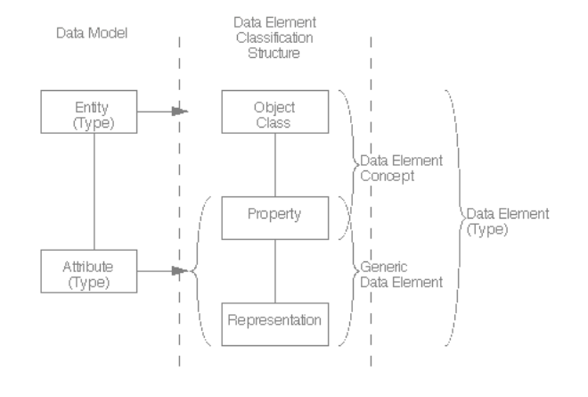

GSIM (Generic Statistical Information Model)
--------------------------------------------

GSIM provides a standardized set of information objects that flow
through the process model in the creation of official statistics as
represented by the Generic Statistical Business Process Model (GSBPM).
GSBPM has been of interest to DDI since in conception. The DDI Generic
Longitudinal Business Process Model (GLBPM) is modeled on the GSBPM
which itself was informed by the DDI Lifecycle Model. DDI has worked
with the UNECE in the development of GSIM to ensure that these two
standards are compatible. In general, GSIM is a conceptual model whereas
DDI is an implementation model. There is a shared interest in ensuring
that DDI-L can be used as a means of implementing the GSIM conceptual
model.

Mapping work and the development of DDI profiles to support GSIM are
taking place within that community. A primary area for close mapping to
the GSIM structure lies in that areas that relate to their reflection of
the ISO/IEC 11179 Data Element Classification Structure. The terminology
for the objects as well as the documentation for the objects reflects
the GSIM model.

This standard describes the structure and content of a data element as
the basic building block of information. DDI -L is particularly
concerned with providing the information needed to populate an ISO/IEC
11179 data element and support a registry structure. The following
diagram provides the Data Element Structure.

**Figure 1.  ISO11179 Data Element Structure**

|figure1|

International Standard ISO/IEC 11179-1: Information technology –
Specification and standardization of data elements – Part 1: Framework
for the specification and standardization of data elements Technologies
de l’informatin – Spécifiction et normalization des elements de données
– Partie 1: Cadre pout la specification et la normalization des elements
de données. First edition 1999-12-01 (p26)
https://www.oasis-open.org/committees/download.php/6233/c002349_ISO_IEC_11179-1_1999%28E%29.pdf

In DDI terminology, the Object Class is defined by the universe, its
Property is the concept, and the Representation is the Representation
content used by the Variable that measures it.

ConceptualComponent contains Universe and Concept definitions while
Representation is described within the Variable. In most DDI instances
it is the Variable that ties the three sections of this definition
together. Note that if the Variable does not include a concept reference
the instance is not compliant with ISO/IEC 11179.

DDI 3.2 has added the ability to create the more abstract (or reusable)
descriptions of an ISO/IEC 11179 Data Element and Data Element Concept.
These have been structured to align with the GSIM description (see GSIM
in this section). The 3.1 element DataElementConcept has been replaced
by a ConceptualVariable located within ConceptualComponent. This object
links a Concept with a Universe creating the equivalent of the ISO/IEC
11179 Data Element Concept. A RepresentedVariable located in Logical
Product, adds the expression of the representation to the concept and
universe. This is the reusable set of information for a Variable which
is the implementation of a RepresentedVariable within a specific usage.
The underlying RepresentedVariable may be referenced from the Variable
